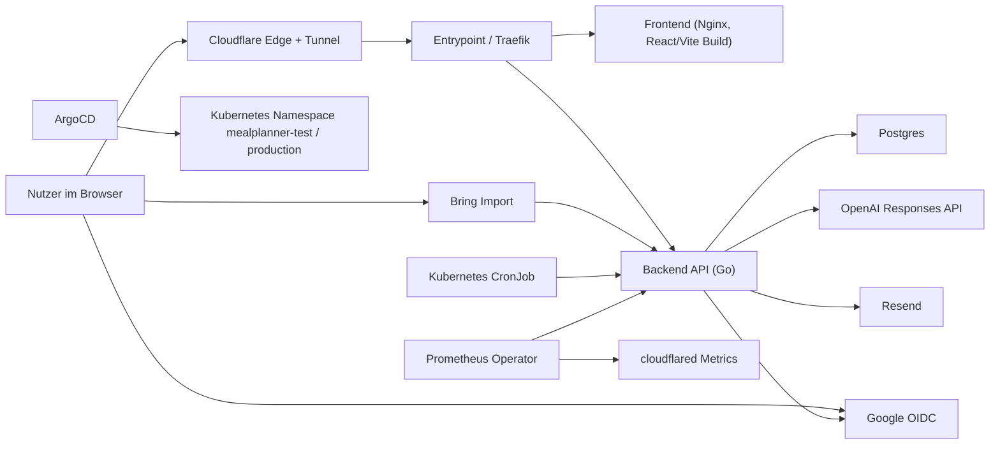

# Architekturübersicht

Stand: 2026-04-21

Diese Seite ist die technische Gesamtübersicht für `mealplanner`. Sie beschreibt alle relevanten
Services, SaaS-Dienste und Betriebs-Komponenten.

## Systemkontext

## Laufende App-Komponenten

### Frontend

- Komponente: `frontend`
- Laufzeit: `nginx:alpine` mit gebautem React/Vite-Frontend
- Quellpfad: [frontend](/Users/markus/repo/mealplanner/frontend)
- Deployment: [deploy/base/frontend-deployment.yaml](/Users/markus/repo/mealplanner/deploy/base/frontend-deployment.yaml)
- Service: [deploy/base/frontend-service.yaml](/Users/markus/repo/mealplanner/deploy/base/frontend-service.yaml)
- Aufgabe:
  - UI für Wochenplan, Profil, Familie, Admin, Feedback
  - nutzt Backend-API über `/api/...`

### Backend API

- Komponente: `api`
- Laufzeit: Go HTTP API
- Quellpfad: [backend/api](/Users/markus/repo/mealplanner/backend/api)
- Entrypoint: [main.go](/Users/markus/repo/mealplanner/backend/api/cmd/api/main.go)
- Deployment: [deploy/base/api-deployment.yaml](/Users/markus/repo/mealplanner/deploy/base/api-deployment.yaml)
- Service: [deploy/base/api-service.yaml](/Users/markus/repo/mealplanner/deploy/base/api-service.yaml)
- Aufgabe:
  - Profile, Familien, Favoriten, Pläne
  - Auth/Session/CSRF
  - OpenAI-Planung und Regeneration
  - Bring-Export
  - Feedback
  - Admin-Funktionen
  - Mailversand

### Datenbank

- Komponente: `postgres`
- Laufzeit: `postgres:17-alpine`
- Deployment: [deploy/base/postgres-statefulset.yaml](/Users/markus/repo/mealplanner/deploy/base/postgres-statefulset.yaml)
- Service: [deploy/base/postgres-service.yaml](/Users/markus/repo/mealplanner/deploy/base/postgres-service.yaml)
- Storage: [deploy/base/postgres-pvc.yaml](/Users/markus/repo/mealplanner/deploy/base/postgres-pvc.yaml)
- Aufgabe:
  - persistiert User, Sessions, Familien, Profile, Pläne, Favoriten, Feedback, Premium, Mail-Templates, User-Settings

### Datenbank-Bootstrap

- Komponente: `database-bootstrap`
- Laufzeit: Kubernetes Job
- Dateien:
  - [deploy/base/database-bootstrap-job.yaml](/Users/markus/repo/mealplanner/deploy/base/database-bootstrap-job.yaml)
  - [deploy/base/database-bootstrap-script-configmap.yaml](/Users/markus/repo/mealplanner/deploy/base/database-bootstrap-script-configmap.yaml)
  - [deploy/base/database-bootstrap-rbac.yaml](/Users/markus/repo/mealplanner/deploy/base/database-bootstrap-rbac.yaml)
- Aufgabe:
  - initiale Secrets für Datenbank und API sicherstellen
  - Platzhalter/Defaults für Namespace-Setup setzen

### Wöchentliche Planung

- Komponente: `weekly-plan`
- Laufzeit: Kubernetes CronJob
- Datei: [deploy/base/weekly-plan-cronjob.yaml](/Users/markus/repo/mealplanner/deploy/base/weekly-plan-cronjob.yaml)
- Aufgabe:
  - triggert die interne Wochenplan-Erzeugung über die API

## Routing und Edge

### Cloudflare Tunnel

- Komponente: `cloudflared`
- Deployment: [deploy/base/cloudflared-deployment.yaml](/Users/markus/repo/mealplanner/deploy/base/cloudflared-deployment.yaml)
- Konfiguration: [deploy/base/cloudflared-configmap.yaml](/Users/markus/repo/mealplanner/deploy/base/cloudflared-configmap.yaml)
- Service: [deploy/base/cloudflared-service.yaml](/Users/markus/repo/mealplanner/deploy/base/cloudflared-service.yaml)
- Aufgabe:
  - veröffentlicht `mealplanner.markushartmann.dev` ohne offenen Inbound-Port
  - verbindet Cloudflare Edge mit dem internen Cluster-Zugang

### Entrypoint / Traefik

- Komponente: `entrypoint`
- Deployment: [deploy/base/entrypoint-deployment.yaml](/Users/markus/repo/mealplanner/deploy/base/entrypoint-deployment.yaml)
- Dynamische Config: [deploy/base/entrypoint-configmap.yaml](/Users/markus/repo/mealplanner/deploy/base/entrypoint-configmap.yaml)
- ACME-Storage: [deploy/base/entrypoint-acme-pvc.yaml](/Users/markus/repo/mealplanner/deploy/base/entrypoint-acme-pvc.yaml)
- Aufgabe:
  - interner Router für Frontend und API
  - LAN-Zugang über MetalLB/LoadBalancer

## Externe SaaS- und Fremddienste

### OpenAI

- Rolle: Rezept- und Wochenplan-Generierung
- Integration:
  - Provider-Code in [backend/api/internal/provider](/Users/markus/repo/mealplanner/backend/api/internal/provider)
  - Planner in [backend/api/internal/planner](/Users/markus/repo/mealplanner/backend/api/internal/planner)
- API-Modus:
  - lokal/test optional `mock`
  - live über `PROVIDER_MODE=live`
- Zweck:
  - Wochenpläne
  - Mahlzeiten-Regeneration
  - Profil-/Familien-Merge-Unterstützung

### Google OIDC

- Rolle: Login
- Integration:
  - [backend/api/internal/auth/auth.go](/Users/markus/repo/mealplanner/backend/api/internal/auth/auth.go)
  - [backend/api/internal/httpapi/auth.go](/Users/markus/repo/mealplanner/backend/api/internal/httpapi/auth.go)
- Zweck:
  - Google Sign-In
  - Session-Erzeugung im Backend

### Resend

- Rolle: transaktionaler Mailversand
- Integration:
  - [backend/api/internal/mailer](/Users/markus/repo/mealplanner/backend/api/internal/mailer)
- Verwendet für:
  - Familien-Einladungen
  - Premium-Einladungen
  - automatische Wochenplan-Mails
- Template-Verwaltung:
  - in der Datenbank über `mail_templates`
  - bearbeitbar im Admin-Bereich

### Bring

- Rolle: Einkaufs-/Rezeptimport
- Integration:
  - [backend/api/internal/httpapi/bring_export.go](/Users/markus/repo/mealplanner/backend/api/internal/httpapi/bring_export.go)
- Zweck:
  - signierte Exportseiten
  - Rezept-/Tag-/Wochenexporte für Bring

### Cloudflare

- Rolle:
  - DNS
  - TLS am Edge
  - Tunnel-Zugang
- Zweck:
  - öffentliche Erreichbarkeit von `mealplanner.markushartmann.dev`

## Monitoring und Diagnose

### Prometheus / ServiceMonitor

- API-Monitoring: [deploy/base/api-servicemonitor.yaml](/Users/markus/repo/mealplanner/deploy/base/api-servicemonitor.yaml)
- cloudflared-Monitoring: [deploy/base/cloudflared-servicemonitor.yaml](/Users/markus/repo/mealplanner/deploy/base/cloudflared-servicemonitor.yaml)
- Zweck:
  - API-Health und Metrics
  - Tunnel-Metriken

### Prompt-Debug

- Backend-API: `/api/debug/prompts/latest`
- Nur in Test aktiviert
- Zweck:
  - letzter Prompt
  - Prompt-Historie
  - OpenAI Request-/Token-Aggregate

### Feedback

- UI-Komponente: Premium-/Admin-Feedbackbox unten rechts
- Backend-Endpoint: `POST /api/feedback`
- Admin-Auswertung:
  - im Admin-Bereich sichtbar
  - anonymisierte Rückmeldungen mit Seitenbezug

## Datenmodell auf hohem Niveau

### Identität

- `users`
- `sessions`
- Google-OIDC-basierte Login-Identitäten

### Familien- und Produktdaten

- `families`
- `family_members`
- `profiles`
- `plans`
- `favorite_recipes`

### Admin / Premium / Diagnose

- `premium_users`
- `generation_events`
- `feedback_entries`
- `prompt_debug_entries`
- `user_settings`
- `mail_templates`

## Sicherheitsrelevante Komponenten

- Sessions via `HttpOnly`, `Secure`, `SameSite=Lax`
- CSRF-Schutz über `X-CSRF-Token`
- Security Headers in API/Frontend-Pfad
- signierte Bring-Export-Links
- NetworkPolicies:
  - [deploy/base/network-policy.yaml](/Users/markus/repo/mealplanner/deploy/base/network-policy.yaml)

## GitOps und Auslieferung

### Kustomize

- Base: [deploy/base/kustomization.yaml](/Users/markus/repo/mealplanner/deploy/base/kustomization.yaml)
- Test: [deploy/test/kustomization.yaml](/Users/markus/repo/mealplanner/deploy/test/kustomization.yaml)
- Production: [deploy/production/kustomization.yaml](/Users/markus/repo/mealplanner/deploy/production/kustomization.yaml)

### ArgoCD

- App-Definition: [deploy/argocd/app-mealplanner-test.yaml](/Users/markus/repo/mealplanner/deploy/argocd/app-mealplanner-test.yaml)
- Zweck:
  - Sync des Test-Overlays

### GitHub Actions

- CI: [.github/workflows/mealplanner-ci.yml](/Users/markus/repo/mealplanner/.github/workflows/mealplanner-ci.yml)
- Test-Image-Publish: [.github/workflows/mealplanner-publish-test-images.yml](/Users/markus/repo/mealplanner/.github/workflows/mealplanner-publish-test-images.yml)

## Umgebungen

### Test

- Namespace: `mealplanner-test`
- Besonderheiten:
  - `PROMPT_DEBUG=true`
  - `APP_ENV=test`
  - `PROVIDER_MODE=live`

### Production

- vorbereitet über `deploy/production`
- zusätzliche PDBs:
  - [deploy/production/api-pdb.yaml](/Users/markus/repo/mealplanner/deploy/production/api-pdb.yaml)
  - [deploy/production/frontend-pdb.yaml](/Users/markus/repo/mealplanner/deploy/production/frontend-pdb.yaml)

## Offene Betriebsabhängigkeiten

- Resend braucht eine verifizierte Sender-Domain für echte Zustellung.
- Google OIDC braucht gültige OAuth-Credentials und Redirect-URLs.
- OpenAI Live-Modus braucht `OPENAI_API_KEY`.
- Cloudflare Tunnel braucht gültige Tunnel-Credentials.

## Verwandte Dokumente

- [README.md](/Users/markus/repo/mealplanner/README.md)
- [security.md](/Users/markus/repo/mealplanner/docs/security.md)
- [PRODUCTION_READINESS.md](/Users/markus/repo/mealplanner/docs/PRODUCTION_READINESS.md)
