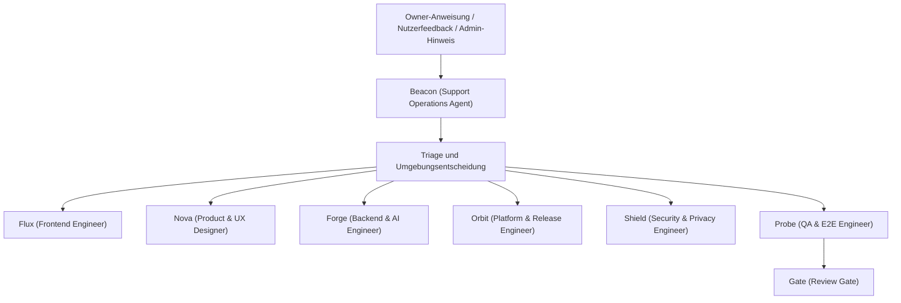
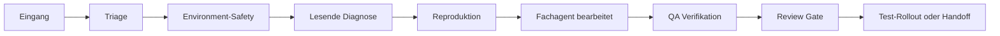
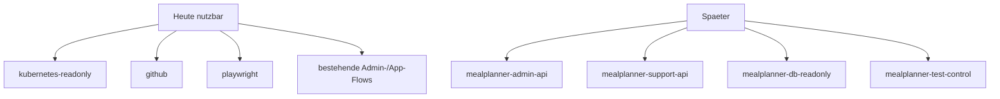

# Support Agent

Stand: 2026-04-22

Diese Seite beschreibt einen vorgeschlagenen Support-Agenten fuer `mealplanner`, der
Nutzerfeedback, Owner-Anweisungen sowie Test- und spaeter Production-Diagnosen bearbeitet.
Der Agent ist bewusst nicht als unbeschraenkter Superuser gedacht, sondern als orchestrierender
Operator mit eng geschnittenen Faehigkeiten.

## Zielbild

Der Support-Agent soll:

- Nutzerprobleme aus Feedback, Admin-Ansicht oder Owner-Anweisungen aufnehmen
- den Fall zuerst fachlich klassifizieren
- Test und Production strikt trennen
- Daten, API und Betriebszustand sicher lesen koennen
- definierte Support-Aktionen gezielt ausloesen koennen
- fuer Code-, Rollout- oder Datenschutzthemen die bestehenden Repo-Agenten ziehen

Nicht-Ziele:

- kein freier DB-Schreibzugriff
- kein generischer Kubernetes-Schreibzugriff in Production
- kein Zugriff auf Secrets oder Roh-Credentials
- keine unprotokollierten Nutzerkontomanipulationen

## Grafische Einordnung

### Rolle im Agentenmodell

Rufname fuer direkte Ansprache: `Beacon`

### Aufgabenfluss im Supportfall

### Aktuell verfuegbare und spaetere Bausteine

## Empfohlenes Modell

### Support Operations Agent

- Rufname: `Beacon`
- Modell: `gpt-5.4`
- Reasoning: `high`
- Grund:
  - Supportanfragen sind oft unscharf formuliert
  - der Agent muss zwischen UI-, Daten-, API- und Betriebsproblemen unterscheiden
  - spaeter in Production ist ein konservatives Entscheidungsverhalten wichtiger als reine Geschwindigkeit

### Zusaetzliche Hilfsmodelle

- Triage, Feedback-Clustering, einfache Zusammenfassungen: `gpt-5.4-mini`
- konkrete Codearbeit in `frontend/` oder `backend/api/`: `gpt-5.2-codex`
- Review-/Freigabegate bei sensiblen Faellen: `gpt-5.4`

## Einbindung ins Agent Framework

Der Support-Agent ist kein Ersatz fuer das feste Team, sondern ein Orchestrator darueber.

Empfohlene Zusammenarbeit:

1. `Beacon` nimmt Fall und Umgebung auf
2. `Shield` wird bei personenbezogenen Daten, Sessions, Mail, Feedback oder Production-Exposure zwingend beigezogen
3. `Forge` bearbeitet API-, Planer-, Mail- oder Datenlogik
4. `Flux` und `Nova` bearbeiten UI-/UX-Faelle
5. `Orbit` bearbeitet Rollout-, GHCR-, Argo-, Tunnel- oder Cluster-Themen
6. `Probe` reproduziert und verifiziert den Nutzerfall
7. `Gate` bleibt Pflicht vor Test- oder spaeterem Prod-Rollout

## Benötigte Skills

### Vorhandene Skills aus diesem Setup

- `build-web-apps:frontend-skill`
- `build-web-apps:react-best-practices`
- `build-web-apps:web-design-guidelines`
- `openai-docs` fuer OpenAI-/Modellfragen

### Empfohlene neue lokale Skills

#### `mealplanner-support-triage`

- Zweck: Supportfall sauber einordnen
- Kategorien:
  - UI/UX
  - Daten / Nutzerzustand
  - API / Handler / Businesslogik
  - Betrieb / Deployment / Mail / Tunnel
  - Feedback / Produktwunsch

#### `mealplanner-env-safety`

- Zweck: harte Trennung zwischen Test und Production
- Regeln:
  - Test darf reproduziert, beschrieben und gezielt veraendert werden
  - Production ist standardmaessig read-only
  - jede riskante Production-Mutation braucht explizite Owner-Freigabe

#### `mealplanner-feedback-ops`

- Zweck: Admin-Feedback verarbeiten
- Aufgaben:
  - offene Feedbacks lesen
  - duplizierte Themen gruppieren
  - Produkt-/Bug-/Ops-Labels vergeben
  - geloeste Feedbacks sauber abschliessen

#### `mealplanner-support-playbook`

- Zweck: Standardverfahren fuer wiederkehrende Faelle
- Beispiele:
  - Wochenplan fehlt
  - Invite-Mail kam nicht an
  - Bring-Link wirkt kaputt
  - Premium-Status unklar
  - Mobile-Layout bricht
  - Test und Production verhalten sich unterschiedlich

## Heute umsetzbare MCPs / Tools

Ohne neue `mealplanner-*` MCPs ist der Support-Agent bereits sinnvoll nutzbar, wenn er sich auf
vorhandene Tools und bestehende App-/Admin-Flows stützt.

### 1. `kubernetes-readonly`

Pflichtumfang:

- Deployments lesen
- Rollout-Status lesen
- Pod-Logs lesen
- Events lesen
- Service-/Ingress-/Tunnel-Zustand lesen

Geeignet fuer:

- Frontend/API nicht erreichbar
- Pod crasht
- CronJob oder Mailpfad wirkt defekt
- Test/Prod verhalten sich unterschiedlich

### 2. `github`

Pflichtumfang:

- Issues lesen und erstellen
- PRs lesen
- CI-Status lesen
- Review-/Rollout-Kontext verlinken

Nutzen:

- Supportfall in Issue oder PR ueberfuehren
- Statuskommunikation und Nachverfolgung

### 3. `playwright`

Pflichtumfang:

- Browserflows reproduzieren
- Mobile/Desktop testen
- Sichtbare UI-Regressionen oder Nutzerfehler konkret belegen

### 4. optionale vorhandene Connectors spaeter

- `gmail` fuer Mail-Support-Drafts
- `google-drive` fuer Support-Notes, Runbooks oder Customer-Summaries

### 5. bereits vorhandene Produktpfade ohne neuen MCP

- Admin-UI / vorhandene Admin-API:
  - Feedback lesen
  - Feedback resolve
  - Mail-Templates lesen
  - Statistiken lesen
- oeffentliche und authentifizierte App-Flows:
  - UI-Reproduktion
  - Invite-, Plan- und Mobile-Verhalten pruefen
- vorhandene Repo- und Betriebsdoku:
  - API-Vertrag
  - Architektur
  - Security- und Rollout-Regeln

## Bereits jetzt umsetzbare lokale Skills

Diese repo-lokalen Skills koennen ohne neue MCPs eingeführt werden:

- [skills/mealplanner-support-triage/SKILL.md](/Users/markus/repo/mealplanner/skills/mealplanner-support-triage/SKILL.md)
- [skills/mealplanner-env-safety/SKILL.md](/Users/markus/repo/mealplanner/skills/mealplanner-env-safety/SKILL.md)
- [skills/mealplanner-feedback-ops/SKILL.md](/Users/markus/repo/mealplanner/skills/mealplanner-feedback-ops/SKILL.md)
- [skills/mealplanner-support-playbook/SKILL.md](/Users/markus/repo/mealplanner/skills/mealplanner-support-playbook/SKILL.md)

## Spaetere MCP-Ausbaustufe

Die folgenden MCPs sind bewusst noch Zukunftsthemen und nicht Teil der jetzigen Umsetzung:

- `mealplanner-admin-api`
- `mealplanner-support-api`
- `mealplanner-db-readonly`
- `mealplanner-test-control`

## Rechte-Modell

### Test

- GitHub, Playwright, Kubernetes-Readonly: erlaubt
- vorhandene App- und Admin-Flows: erlaubt
- Testdatenmutationen nur soweit heute bereits über bestehende App-/Admin-Funktionen möglich
- Kubernetes read-only: erlaubt
- Rollout nur ueber `Orbit`

### Production

- GitHub, Playwright, Kubernetes-Readonly: erlaubt
- bestehende Admin-/App-Flows lesen und reproduzieren: erlaubt
- DB: nur spaeter ueber dedizierten `mealplanner-db-readonly` MCP
- Support-Mutationen erst spaeter ueber explizite Support-Endpunkte
- keine direkten DB-Writes
- keine freien Cluster-Schreibrechte
- keine Secrets

## Spaetere API- und MCP-Erweiterungen

Die bestehende API deckt Admin-Feedback bereits gut ab. Fuer einen spaeteren vollwertigen
Support-Agenten waeren diese zusaetzlichen MCP/API-Bausteine sinnvoll, werden aber jetzt bewusst
nicht umgesetzt:

### Neue Support-Endpunkte

#### `GET /api/admin/support/cases/{caseID}`

- liefert aggregierte Sicht auf User/Familie/Profil/aktuellen Plan/letzte Feedbacks
- nur Admin

#### `POST /api/admin/support/families/{familyID}/plan/regenerate`

- triggert explizit eine sichere Neuplanung
- nur Admin
- protokolliert `triggeredBy`, `reason`, `requestId`

#### `POST /api/admin/support/invites/{inviteID}/resend`

- sendet eine bestehende Einladung erneut
- nur Admin

#### `GET /api/admin/support/diagnostics/families/{familyID}`

- aggregierte Diagnoseantwort fuer Support
- ohne freie SQL-Abfragen

### API-Regeln

- alle Support-Mutationen brauchen CSRF und Admin-Session
- alle Responses enthalten eine `requestId`
- jede Mutation erzeugt Audit-Metadaten
- keine Endpunkte fuer willkuerliche Feldmanipulationen

## Betriebsablauf eines Supportfalls

1. Eingang ueber Feedback, Admin-Ansicht oder direkte Owner-Anweisung
2. Support-Agent klassifiziert Fall und Umgebung
3. sichere Datenquellen lesen:
   - vorhandene Admin-API
   - GitHub
   - Playwright
   - Kubernetes-readonly
4. falls noetig Reproduktion in Test oder via Playwright
5. Spezialagenten ziehen:
   - UI -> Product/Frontend
   - API -> Backend
   - Betrieb -> Platform
   - sensible Daten -> Security
6. Ergebnis dokumentieren:
   - geloestes Feedback
   - Issue oder PR
   - Supportnote / Handoff
7. vor Rollout:
   - `Probe`
   - `Gate`
8. Test-Rollout durch `Orbit`
9. spaeter ggf. separater Production-Rollout

## Warum dieser Zuschnitt

Dieses Design passt zu `mealplanner`, weil:

- bereits Admin-, Feedback- und Diagnose-Flaechen vorhanden sind
- Test und Production ueber Kustomize/Argo klar getrennt sind
- Datenschutz und Familien-/Session-Daten sensibel sind
- das Repo bereits ein festes Agententeam mit klaren Rollen besitzt

Der Support-Agent wird damit zu einem sicheren Operator fuer Support und Produktbetrieb statt zu
einem unkontrollierten Generalisten mit Vollzugriff.
